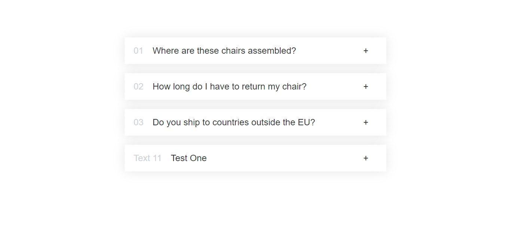

# Accordio Component
A simple website created to practice on heavy approach list rendering, managing state of component, Hiding sections of a component with conditional rendering, && operator

# List Rendering, State Management, and Conditional Rendering App

This is a simple application built in React that practices heavy approach list rendering, managing state of component, hiding sections of a component with conditional rendering, && operator.

# Images 

# Getting Started
1.To run the app, you will need to have Node.js and NPM installed. Once you have those installed, 

2.Clone the repo:- 
https://github.com/Emmanuel687/Accordio-Component.git

3.Run the following commands:

npm install
npm start

4.This will start the app in development mode. You can then open the app in your browser at http://localhost:3000.

# Features
1.The app renders a list of items using a heavy approach.

2.The app manages the state of the list using the useState hook.

3.The app hides sections of the list with conditional rendering.

4.The app uses the && operator to conditionally render elements.

# Author
This app was created by Emmanuel Kiprotich.

# License
This app is licensed under the MIT License.